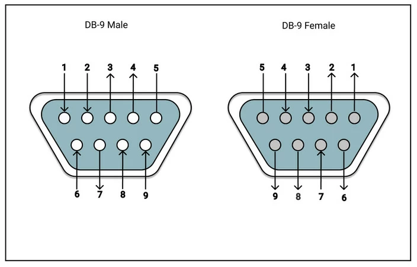

# G27 Pedals and Shifter

Arduino-based USB interface for Logitech G27 pedals and shifter:

## Credits

This fork wouldn't have been possible without the great project from functionreturnfunction: https://github.com/functionreturnfunction/G27_Pedals_and_Shifter. I am going to maintain this fork as long as my G27 shifter and pedals live on.

## Required Parts/Materials

* [SparkFun Pro Micro](https://www.sparkfun.com/products/12640) or clone (must be a 5V/16MHz ATmega32U4 with onboard USB)
* [DB9 Connectors](http://www.amazon.com/Female-Male-Solder-Adapter-Connectors/dp/B008MU0OR4/ref=sr_1_1?ie=UTF8&qid=1457291922&sr=8-1&keywords=db9+connectors) 1 male, 1 female
* Hookup wire in assorted colors (I used red, black, blue, green, purple, yellow, orange, and white)
* Some kind of project box (I used an Altoids tin)

## Assembly

Connect the female DB9 connector for the pedals to the board using the pins in the table in the .ino file.  Do the same with the male DB9 for the shifter.

NOTE: when wiring the male connector for the shifter, remember that the pins will read right to left rather than left to right.

## Firmware

Open the .ino file in the Arduino IDE, select the proper board type and COM port under "Tools" (you will need to install the [SparkFun board library](https://github.com/sparkfun/Arduino_Boards)). 

## Calibration and Configration

After the firmware has been uploaded to the arduino, you want to calibrate and configure the SW for your specific device. There is a python-based graphical user interface available in this project. 

### GUI installation

#### Using binary releases (windows only)

The easiest method is to download g27calib.zip from the latest release here https://github.com/n-e-y-s/G27_Pedals_and_Shifter/releases/latest. Unzip this to a location of your choice and then start g27calib.exe located inside. 

#### Alterantively use python directly

This description assumes a windows operating system (other operating systems are similar; I have tested linux and windows). You need python3 for running this GUI - if you don't have a python3 interpreter on your system already, I suggest to get the interpreter at http://winpython.github.io/. I'd choose the minimal python 3.7 64 bit version, but other versions or distributions should also work. 

When you have a python interpreter in place, I suggest to create a virtual environment using the shell commands:
    
    cd <a path of your choice>
    python -m venv g27calib

This command creates a virtual python environment in the directory g27calib. Afterwards you can install the GUI with 

    .\g27calib\Scripts\pip install git+https://github.com/n-e-y-s/G27_Pedals_and_Shifter@master#egg=G27_Pedals_and_Shifter_GUI

Of course you can also specify a local path alternatively to the git path above. Pip downloads some packages from the internet and finally you should be able to start

    g27calib/Scripts/g27calib
    
and the gui should open.

### Calibration process

At first you need to select the Arduino serial device (note that this is **not** COM1 on windows). On linux platforms, it is also necessary to select the joystick device of the G27, otherwise the GUI might be very slow:

When everything is set correctly, press the Start button. You are presented with the calibration/configurtion GUI:

On the upper right, you get some help text about what to do next. Using that everything shall be pretty self-explaining. The graphs in the lower part are for the pedals and the shifter respectively. You see the measurements over the last second depicted with the "+" marks. 

The first step is to decide for a suitable filtering. Depending on the wear of your device, the measurements can be quite noisy and so it might be desirable to enable the median filtering in the options panel. When changing the values you will see the immediate effect on the measurements.

Afterwards you probably want at least to calibrate your shifter by selecting the calibration values for the shifter on the upper left panel. Optionally you can also pre-calibrate your pedals such that the values are stored on the Arduino. The default is to use auto-calibration for the pedals.

Note that there is the status line output with some profiling output on the left side and the final output values of the axis, buttons and gear value as delivered to the games. 

Last step is to save the settings to the Arduino's EEPROM using the respective button. You can test that this has been working by going back to the default calibration (plots should change) and then reloading the EEPROM calibration (plots should change to the desired values). Everytime you turn on the Arduino it loads the EEPROM calibration automatically from now on.

Known issue (see here: https://github.com/n-e-y-s/G27_Pedals_and_Shifter/issues/1): On windows, the arduino will be slow after closing the GUI. To fix that, you can plug out the USB connector and plug it in again.
